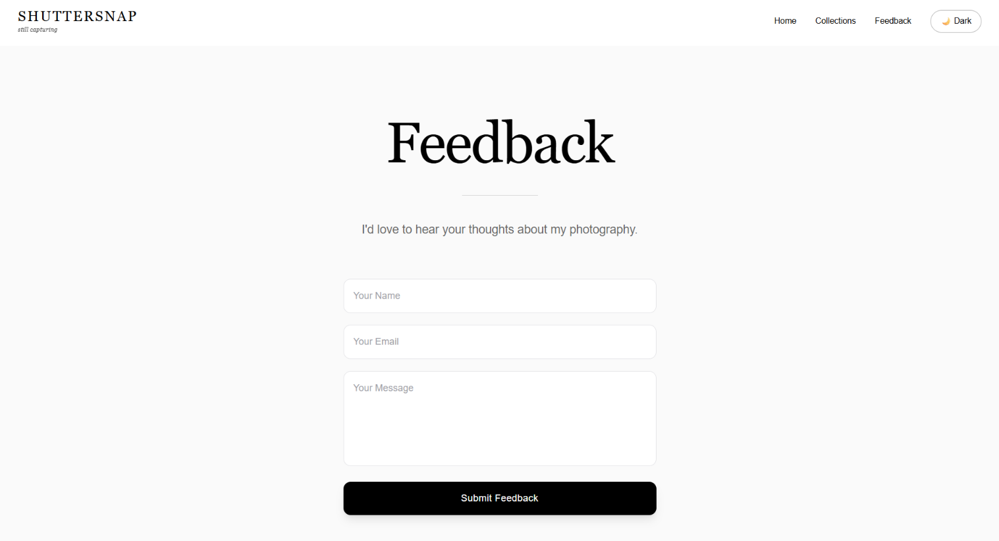

# 📸 SHUTTERSNAP 
<p align="center">
  <em>"still capturing"</em>
</p>
<p align="center">
  
</p>


<p align="center">

[](https://shuttersnap.vercel.app)
[](https://nextjs.org/)
[](https://react.dev/)
[](https://www.typescriptlang.org/)
[](https://tailwindcss.com/)

</p>

<p align="center">


</p>

---

# ✨ About

**Shuttersnap** is a modern full-stack photography portfolio crafted to showcase visual storytelling through a cinematic and immersive browsing experience.

Designed with performance, elegance, and responsiveness in mind, the platform combines smooth animations, optimized image delivery, dynamic gallery collections, and a secure feedback system to create an engaging experience across all devices.

Whether viewed on desktop or mobile, every interaction is built to keep the focus where it belongs—on the photographs.

---

# 🌐 Live Demo

### 🚀 https://shuttersnap.vercel.app

> Replace the URL above with your actual deployment if different.

---

# 🖼️ Preview

| Home Page                          | Collections                               | Feedback                               |
| ---------------------------------- | ----------------------------------------- | -------------------------------------- |
|  |       |  |


---

# ✨ Features

## 🎞️ Dynamic Homepage

* Infinite scrolling image marquees
* Randomized image ordering
* Responsive editorial layout
* Smooth transitions

---

## 📚 Smart Collections

* Dynamic category loading
* Hover image scrubber
* Automatic cover selection
* Optimized navigation

---

## 🖼️ Fullscreen Gallery

* Native HTML Dialog Lightbox
* Keyboard-friendly interactions
* Background blur
* Smooth image transitions

---

## ☁️ Cloudinary Integration

* Automatic image optimization
* CDN delivery
* Responsive image sizing
* Auto-quality & modern formats

---

## 💬 Feedback Portal

* Firebase Firestore integration
* Client-side validation
* Honeypot spam protection
* Local rate limiting

---

## 🌗 Theme Switching

* Light & Dark Mode
* Context-based theme management
* Smooth transitions
* Persistent user preference

---

# ⚡ Performance

* Lazy loading
* Responsive images
* Cloudinary CDN
* Optimized rendering
* Fast page navigation
* Zero layout shift
* Mobile-first design

---

# 🛠️ Tech Stack

| Category      | Technology         |
| ------------- | ------------------ |
| Framework     | Next.js 16         |
| Library       | React 19           |
| Language      | TypeScript         |
| Styling       | Tailwind CSS v4    |
| Image Hosting | Cloudinary         |
| Database      | Firebase Firestore |
| Deployment    | Vercel             |

---

# 🏗️ Architecture

```text
                 User
                  │
                  ▼
         Next.js Frontend
                  │
      ┌───────────┴───────────┐
      │                       │
      ▼                       ▼
 Cloudinary API         Firebase Firestore
      │                       │
      ▼                       ▼
 Optimized Images      Feedback Database
```

---

# 📁 Project Structure

```text
shuttersnap/
│
├── app/
│   ├── api/
│   ├── collections/
│   ├── feedback/
│   ├── lib/
│   ├── globals.css
│   ├── layout.tsx
│   └── page.tsx
│
├── components/
│
├── public/
│   ├── screenshots/
│   ├── logo.png
│   └── favicon.ico
│
├── package.json
├── tsconfig.json
├── next.config.ts
└── README.md
```

---

# 🚀 Getting Started

## 1️⃣ Clone Repository

```bash
git clone https://github.com/Rohitkumarpradhan/shuttersnap.git
cd shuttersnap
```

---

## 2️⃣ Install Dependencies

```bash
npm install
```

---

## 3️⃣ Configure Environment Variables

Create a file named

```text
.env.local
```

Add:

```env
CLOUDINARY_CLOUD_NAME=your_cloud_name
CLOUDINARY_API_KEY=your_api_key
CLOUDINARY_API_SECRET=your_api_secret
```

Configure your Firebase project separately and ensure appropriate Firestore security rules are in place.

---

## 4️⃣ Run Development Server

```bash
npm run dev
```

Open

```text
http://localhost:3000
```

---

# 📱 Responsive Design

✔ Desktop

✔ Laptop

✔ Tablet

✔ Mobile

---

# 🚀 Future Roadmap

* [ ] Photographer Dashboard
* [ ] Client Login
* [ ] Booking System
* [ ] Search Images
* [ ] EXIF Metadata Viewer
* [ ] AI Image Tagging
* [ ] Progressive Web App
* [ ] Offline Support

---

# 📬 Contact

I'd love to hear your thoughts, collaborate on projects, or discuss photography and development.

📧 Email

```text
shutter.snap.4@gmail.com
```

📸 Instagram

```text
@shuttersnap4
```


---

# 👨‍💻 Author

**Rohit Kumar Pradhan**

Computer Science & Engineering (Data Science)


---

## 📄 License

Copyright © 2026 Rohit Kumar Pradhan.

All Rights Reserved.

This repository is publicly visible for portfolio and demonstration purposes only.
No permission is granted to copy, modify, redistribute, or use any part of this
project without prior written permission.

<p align="center">

*"Where every frame tells a story."*

</p>


---


If you like this project, consider giving it a **⭐ Star** on GitHub.
---
